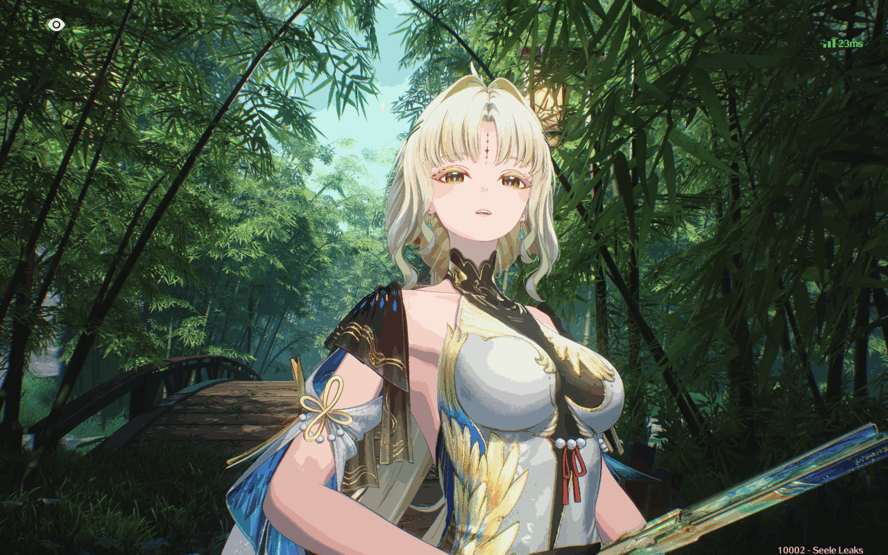

# 绘画工具
### 手机自动化绘画 | 原画还原

**基于ADB的安卓自动化绘图工具**

[](https://www.python.org/downloads/release/python-3150b2/)
[](https://developer.android.com/studio/releases/platform-tools)
[](https://opencv.org/)

简体中文

---

## 效果展示

### 1. 人像图
| 原始图片 | 预览图  | 视频回放 |
| :--- | :--- | :--- |
|  |  | [点击查看视频](previews/原图_回放.mp4) |

### 2. 100元人民币
| 原始图片 | 预览图 | 视频回放 |
| :--- | :--- | :--- |
|  |  | [点击查看视频](previews/100元_回放.mp4) |

---

## 我个人觉得我写的最好的功能

- 视频录制：自动将预览过程及绘画过程合成为，MP4视频，支持自定义帧率。

---

## 快速导航

- [下载最新版](https://github.com/xmzmjmmm/xmabb-OS/releases)
- [使用教程](https://github.com/xmzmjmmm/xmabb-OS/wiki)
- [常见问题 FAQ](https://github.com/xmzmjmmm/xmabb-OS/issues)

---

## 使用教程

### 1. 环境准备
确保电脑已安装 Python 且已添加至系统变量 (PATH)。

### 2. 一键安装依赖
打开终端或 CMD，直接复制并运行以下命令：
```bash
pip install pillow numpy scipy scikit-learn opencv-python -i https://pypi.tuna.tsinghua.edu.cn/simple
```

### 3. 手机设置
- 开启 **开发者选项** -> **USB 调试**。
- 部分机型（如小米）需额外开启 **USB 调试（安全设置）** 才能模拟点击。

---

## 使用前提

- 环境：安装 Python 并将其添加到系统变量。
- 手机：开启 开发者选项 -> USB 调试（部分机型如小米需开启 安全设置）。
- 连接：建议使用原装数据线，确保ADB稳定。

---

## 作者信息

- 项目策划：张一凡
- 联系方式：QQ 3424025921 / 3824503929

---
